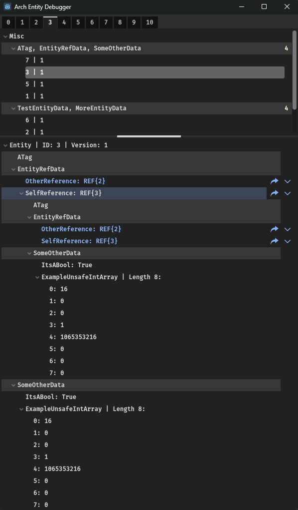
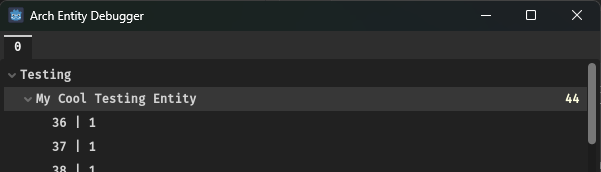
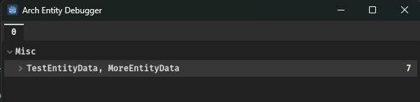

# Arch Entity Debugger for Godot

A debug tool built by **Road Turtle Games** when developing our latest game, [Sweets Inc](https://twitter.com/SweetsIncGame). We decided to make it public to assist other Godot developers in debugging their [Arch](https://github.com/genaray/Arch) entities.



## Features

- **Entity List**: Quickly view all entities in your worlds, categorized by archetype.
- **Entity Inspector**: Dive into each entity's components, and watch updates in real time.

## Installation

Move the "Arch Entity Debugger" folder into the "addons" folder in your Godot project.

Place the Entity_Debugger.tscn scene into a scene in your game.

Optionally, you can enable easy toggling of the Entity Debugger via a hotkey.
To do so add the Entity_Debugger_Hotkey_toggler.tscn scene and set the entityDebugger field, to enable toggling via hotkey ("Shift+`" by default)

## Public Methods

Some public methods are exposed to allow you to control the debugger externally. You can show/hide the debugger, select an entity, or select an active world.

- SetActive(int index) : Sets the window's visibility, and enables/disables processing of entities
- SelectEntity(EntityReference entity) : Selects an entity in the details tree
- SetWorld(int index) : Sets the active world to display entities from

## Customization / Extension

The Entity debugger can be customized to display components or other types in whatever way you like. Create a custom renderer by adding the **EntityRendererAttribute** to a class, and inheriting from **IEntityTreeRenderer**.

Here's a simple example:

```C#
[EntityRenderer(typeof(System.Numerics.Vector3))]
public class Vector3Renderer : IEntityTreeRenderer
{
    public void Render(bool isNew, TreeItem rootItem, object component, string fieldName)
    {
        System.Numerics.Vector3 vector3 = (System.Numerics.Vector3)component;

        rootItem.SetText(0, fieldName);
        rootItem.SetText(0, $"{fieldName}: {vector3}");
    }
}
```

And here's a more complex one:

```C#
[EntityRenderer(typeof(UnsafeList<>))]
public class UnsafeListRenderer<T> : IEntityTreeRenderer
    where T : unmanaged
{
    public void Render(bool isNew, TreeItem rootItem, object component, string fieldName)
    {
        UnsafeList<T> unsafeList = (UnsafeList<T>)component;

        rootItem.SetText(0, $"{fieldName} ({unsafeList.Count}/{unsafeList.Capacity})");

        for (int i = 0; i < unsafeList.Count; i++)
        {
            T item = unsafeList[i];
            EntityTreeRendering.Render(rootItem, item, i, item.ToString());
        }
    }
}
```
You can also customize the display of your archetypes in a similar fashion using the **ArchetypeAttribute** like so:

```C#
[Archetype("Testing/My Cool Testing Entity")]
public static readonly ComponentType[] MY_TEST_ENTITY = new ComponentType[] {
    typeof(TestEntityData),
    typeof(MoreEntityData)
};
```

Any entities matching all of the same component types will be rendered in the tree view and subcategorized based on the slashes in the archetype name string:



Without customization, this same entity will instead display a list of component types in the "Misc" category:



It is recommended to use archetype names, for organizational purposes, but also due to an issue where the Godot tree view has weird sizing issues when the main column's text is too long.

## Contributing

We welcome contributions! If you find a bug or have a feature request, please create an issue. If you'd like to contribute code, please fork the repository and submit a pull request.

## License

This addon is licensed under the [Apache License 2.0](LICENSE.MD).

## Contact

- **Road Turtle Games** 
  - Website: [www.roadturtlegames.com](www.roadturtlegames.com)
  - Email: <support@roadturtlegames.com>
